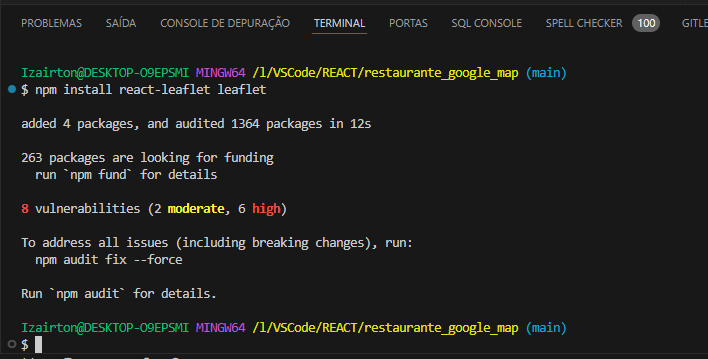
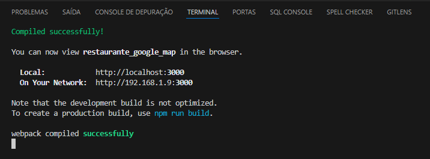
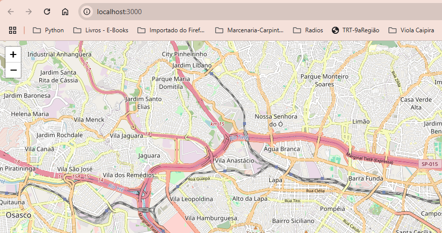
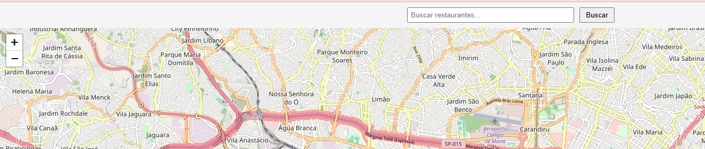
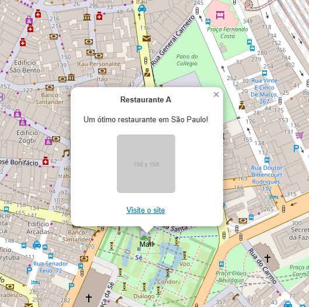
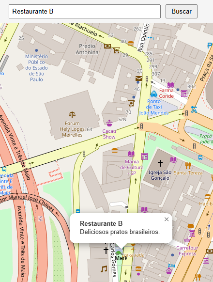
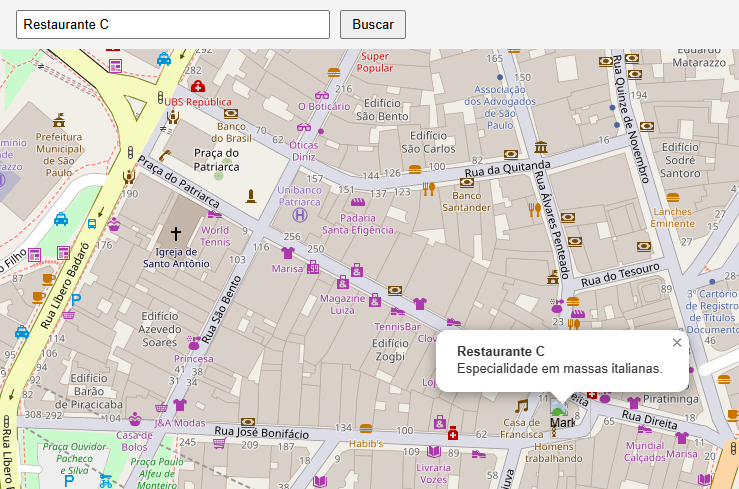
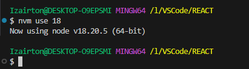

# Restaurante Google Map

## Objetivo do Desafio

Criar um sistema web para buscar restaurantes usando um mapa interativo. A aplicação utiliza React Leaflet para exibir os mapas e permite pesquisar e visualizar informações sobre restaurantes fictícios em um local.

## Estrutura do Projeto

    /restaurante_google_map
    ├── /node_modules
    ├── /public
    ├── /src
    │   ├── /assets
    │   │   └── restaurants.json  # Dados fictícios dos restaurantes
    │   ├── /components
    │   │   └── SearchBar.js      # Componente da barra de pesquisa
    │   ├── /services            # (Para futuras implementações de APIs)
    │   ├── /utils               # (Funções auxiliares, se necessário)
    │   ├── App.css              # Estilo principal da aplicação
    │   ├── App.js               # Componente principal da aplicação
    │   ├── index.css            # Estilo global
    │   └── index.js             # Entrada principal do React
    ├── .gitignore
    ├── package.json
    ├── README.md
    └── Outras_observacoes.md

## Tecnologias Utilizadas

- **React:** Framework JavaScript para criação de interfaces de usuário.

- **React Leaflet:** Biblioteca para mapas interativos baseada no Leaflet.

- **Leaflet:** Biblioteca JavaScript de mapas para renderização leve e personalizável.

- **OpenStreetMap:** Fonte de dados dos mapas exibidos.

## Comandos Utilizados

1. Configuração e Inicialização do Projeto:

    npx create-react-app restaurante_google_map
    cd restaurante_google_map
    npm install react-leaflet leaflet

2. Desenvolvimento:

    - Para rodar o servidor de desenvolvimento:

    npm start

    - Para instalar dependências adicionais (se necessário):

    npm install <package_name>

    - Testes:

    Testar a aplicação localmente em <http://localhost:3000>.

## Imagens do Desenvolvimento do Projeto

## **Imagens do Desenvolvimento**

### Configuração Inicial

### Instalação de Dependências

### Servidor em Execução

### Página com o Leaflet

### Barra de Pesquisa

### Exibindo Popups

### Uso do Node Versão 18

## Agradecimentos

Agradecemos à comunidade de desenvolvedores que contribuem para as bibliotecas React, React Leaflet e Leaflet, além da equipe do OpenStreetMap por fornecer uma base de dados gratuita e acessível.

## Melhorias Futuras

1. Estilização Avançada:

    - Customizar o design dos popups com CSS avançado.

    - Adicionar animações nos marcadores ou elementos interativos.

2. Integração com API Real:

    - Substituir os dados fictícios por uma API que forneça informações reais de restaurantes.

    - Adicionar suporte a filtros (ex.: tipo de cozinha, faixa de preço).

3. Funcionalidades Adicionais:

    - Exibir uma lista lateral dos restaurantes com navegação no mapa.

    - Implementar sistema de geolocalização para encontrar restaurantes próximos.

    - Adicionar avaliações e comentários de usuários nos popups.

4. Performance e SEO:

Este projeto foi uma experiência prática valiosa para aprender a usar React Leaflet e criar aplicações baseadas em mapas. Qualquer feedback ou contribuição futura será muito bem-vinda! 🚀
